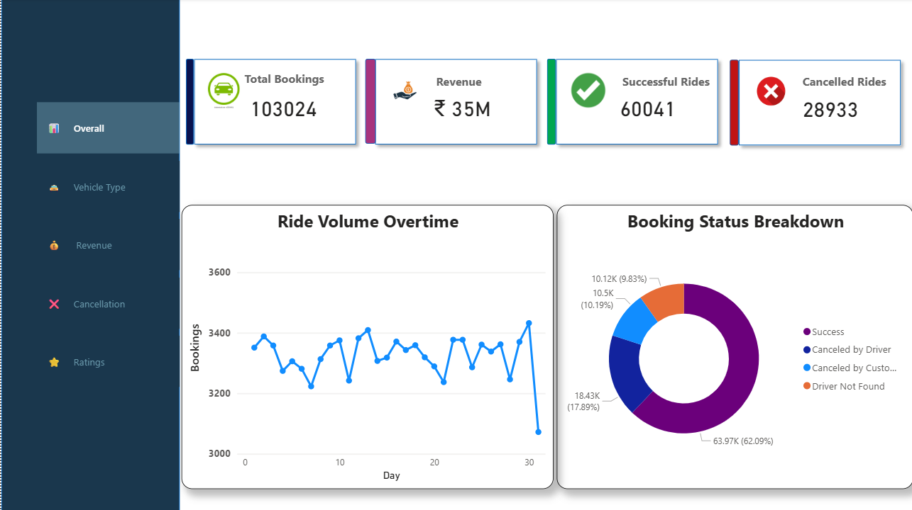
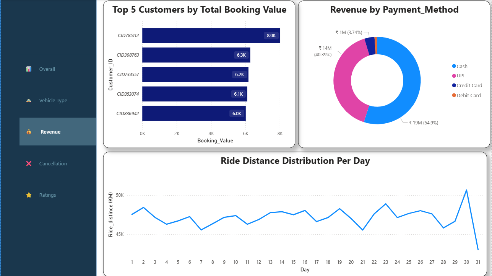
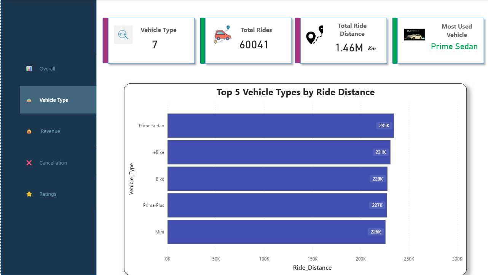
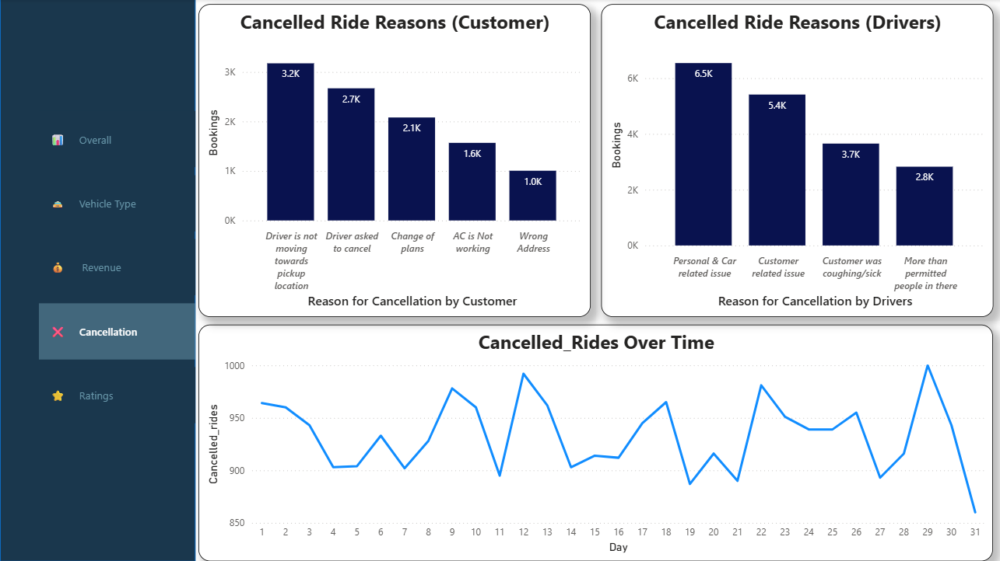
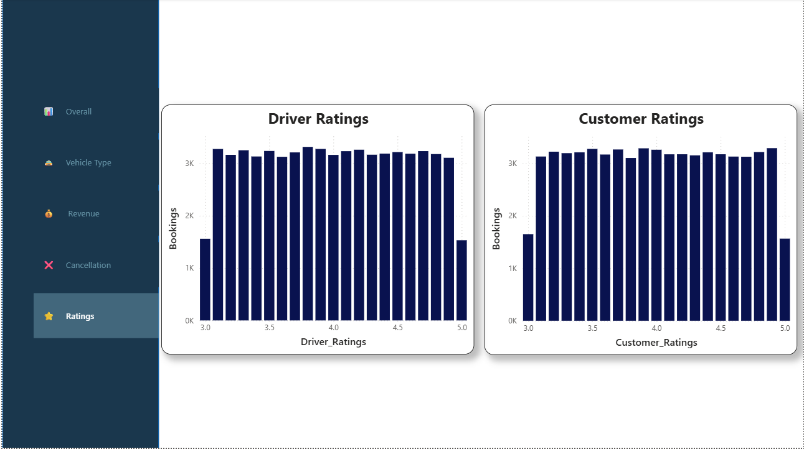

# Ola Ride Insights Analysis

## Project Overview

This project analyzes Ola ride booking data to uncover business insights related to ride demand, customer behavior, revenue generation, cancellations and ratings.

The solution combines:

* SQL for data analysis
* Power BI for interactive dashboards
* Streamlit for application based reporting

The goal is to help stakeholders make data driven decisions to improve operational efficiency and customer experience.

---

## Business Objectives

* Identify peak demand hours and optimize driver allocation.
* Analyze customer behavior for personalized marketing.
* Understand pricing and revenue patterns.
* Investigate ride cancellations.
* Monitor customer and driver ratings.
* Support business decision making using visual analytics.

---

## Tech Stack

### Programming

* Python

### Database

* SQL

### Data Visualization

* Power BI

### Web Application

* Streamlit

### Version Control

* Git
* GitHub

---

## Project Structure

```text
ola-ride-insights-analysis/
│
├── data/
│   └── OLA_DataSet_July.csv
│
├── notebooks/
│   ├── Data_Importing_and_Exploration.ipynb
│   └── Data_Preprocessing_and_Loading.ipynb
│
├── sql/
│   └── ola_queries.sql
│
├── powerbi/
│   └── Ola_Ride_Insights.pbix
│
├── screenshots/
│   ├── architecture.png
│   ├── overall_dashboard.png
│   ├── revenue_dashboard.png
│   ├── cancellation_dashboard.png
│   └── ratings_dashboard.png
│
├── .streamlit/
│   └── config.toml
│
├── database.py
├── Streamlit_apps.py
├── requirements.txt
├── README.md
└── .gitignore
```

### Folder Description

| Folder/File       | Description                                   |
| ----------------- | --------------------------------------------- |
| data/             | Raw dataset used for analysis                 |
| notebooks/        | Data exploration and preprocessing notebooks  |
| sql/              | SQL queries used to extract business insights |
| powerbi/          | Power BI dashboard file                       |
| screenshots/      | Dashboard screenshots                         |
| .streamlit/       | Streamlit configuration files                 |
| database.py       | Database connection                           |
| Streamlit_apps.py | Main Streamlit application                    |
| requirements.txt  | Project dependencies                          |
| README.md         | Project documentation                         |
| .gitignore        | Files and folders excluded from Git tracking  |

---

## Project Workflow

### 1. Data Understanding & Exploration

* Examined ride booking data structure.
* Identified booking status, payment methods, ratings and ride distance metrics.
* Performed exploratory data analysis.

### 2. Data Cleaning & Preprocessing

* Handled missing values.
* Standardized formats and datatypes.
* Validated data consistency.

### 3. SQL Analysis

Implemented SQL queries to answer business questions such as:

* Successful bookings
* Average ride distance by vehicle type
* Customer and driver cancellations
* Top customers
* Payment method analysis
* Rating analysis
* Revenue calculations

### 4. Power BI Dashboard

Created interactive dashboards covering:

#### Overall View

* Ride Volume Over Time
* Booking Status Breakdown

#### Vehicle Type Analysis

* Top Vehicle Types by Ride Distance

#### Revenue Analysis

* Revenue by Payment Method
* Top Customers by Booking Value
* Ride Distance Distribution

#### Cancellation Analysis

* Customer Cancellation Reasons
* Driver Cancellation Reasons

#### Ratings Analysis

* Driver Ratings
* Customer Ratings

### 5. Streamlit Application

Features:

* Interactive SQL query outputs
* Business KPI reporting
* Dashboard integration
* User friendly analytics interface

---

## Key Insights

### Revenue Insights

* Analyzed revenue contribution by payment method.
* Identified top value customers.

### Customer Experience

* Evaluated customer ratings across vehicle categories.
* Highlighted service quality trends.

### Cancellation Analysis

* Identified major cancellation reasons from customers and drivers.

---

## SQL Business Questions Solved

1. Retrieve all successful bookings.
2. Average ride distance by vehicle type.
3. Customer cancellation count.
4. Top 5 customers by bookings.
5. Driver cancellation reasons.
6. Maximum and minimum driver ratings.
7. UPI payment rides.
8. Average customer rating by vehicle type.
9. Total successful booking revenue.
10. Incomplete rides with reasons.

---

## Dashboard Preview

### Overall Dashboard



### Revenue Dashboard



### Vehicle Type Dashboard



### Cancellation Trends Dashboard



### Ratings Dashboard



---

## Results

* Interactive Power BI Dashboard
* SQL driven business insights
* Streamlit analytics application
* Revenue, cancellation and customer experience analysis

---
## How to Run

### Prerequisites

Make sure the following are installed:

* Python 3.12
* Git
* Streamlit

### Clone the Repository

```bash
git clone https://github.com/ukesh2603/Ola_Ride_Insights_Analysis.git
cd Ola_Ride_Insights
```

### Create a Virtual Environment (Optional)

Windows:

```bash
python -m venv venv
venv\Scripts\activate
```

Mac/Linux:

```bash
python3 -m venv venv
source venv/bin/activate
```

### Install Dependencies

```bash
pip install -r requirements.txt
```

### Run the Streamlit Application

```bash
streamlit run Streamlit_apps.py
```

### Project Components

* SQL Queries: `sql/ola_queries.sql`
* Power BI Dashboard: `powerbi/Ola_Ride_Insights.pbix`
* Streamlit Application: `Streamlit_apps.py`
* Dataset: `data/OLA_DataSet_July.csv`


---

## Future Enhancements

* Real time analytics using Kafka.
* Predictive demand forecasting.
* Driver allocation optimization.
* Fraud detection analytics.


